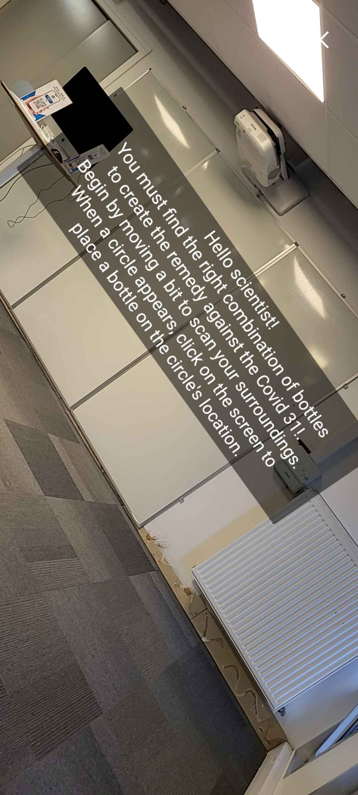

# RAUG-AR-Cahet-Codron
## Link to play the game
https://axelcodron.github.io/RAUG-AR-Cahet-Codron/  
⚠️ The game does not run well on IPhones for... unclear reasons (No gameplay messages and sometime crash) ⚠️

## Authors
Axel Codron, Enora Cahet

## Plot
In this sequel of our previous game ([Infected](https://github.com/AxelCodron/RAUG-Cahet-Codron)), you are the scientist supposed to create the remedy to cure the people infected by the zombie apocalypse. To do so, follow the right pattern to create the final solution!

## Controls
Use your phone to scan your surroundings and play the game! You will only have to tap on the screen to advance in the gameplay.

## Gameplay images

## Copyrights
### Models
lowpoly flask: https://skfb.ly/69spZ  
lowpoly glass bottle: https://skfb.ly/6ToPr  
lowpoly potion: https://skfb.ly/oJQot

### Sound Design
All the sound design has been created on FL Studio by Axel Codron 😎.
